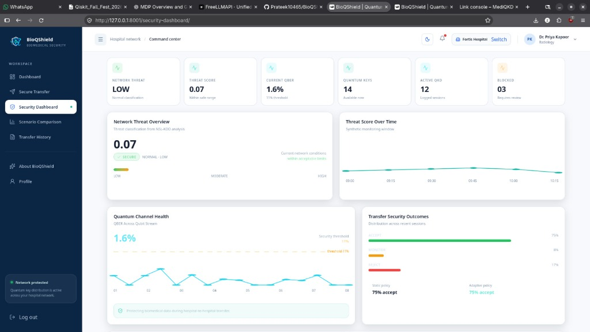
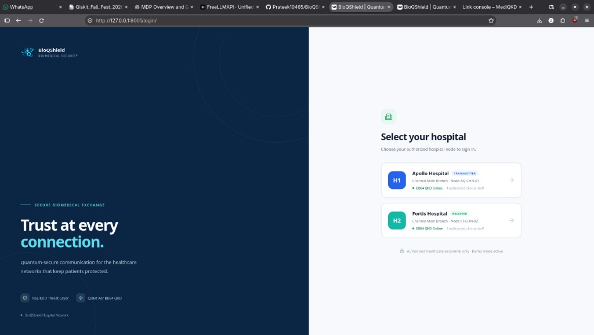
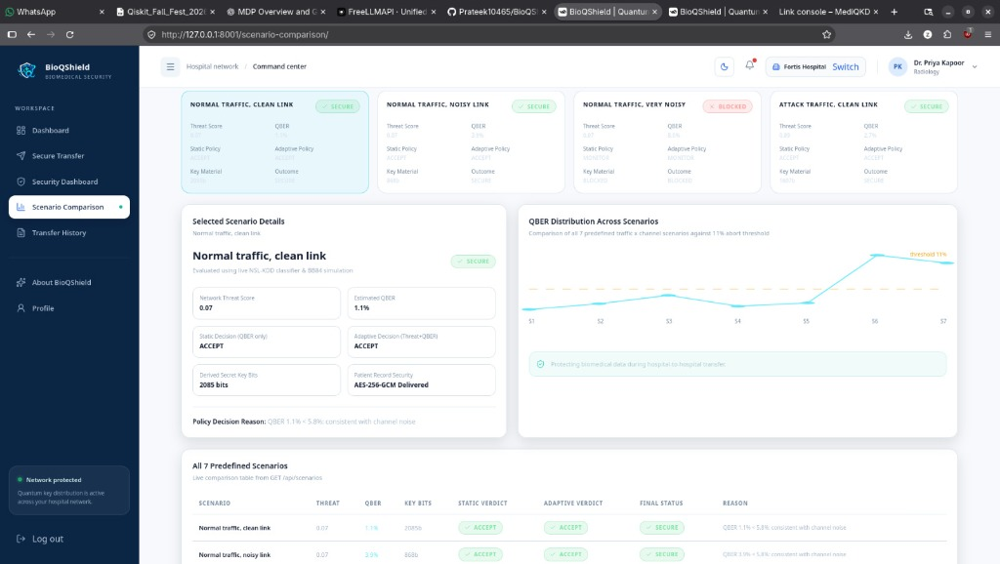
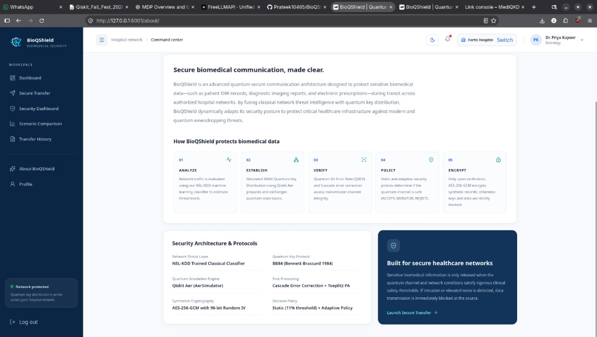
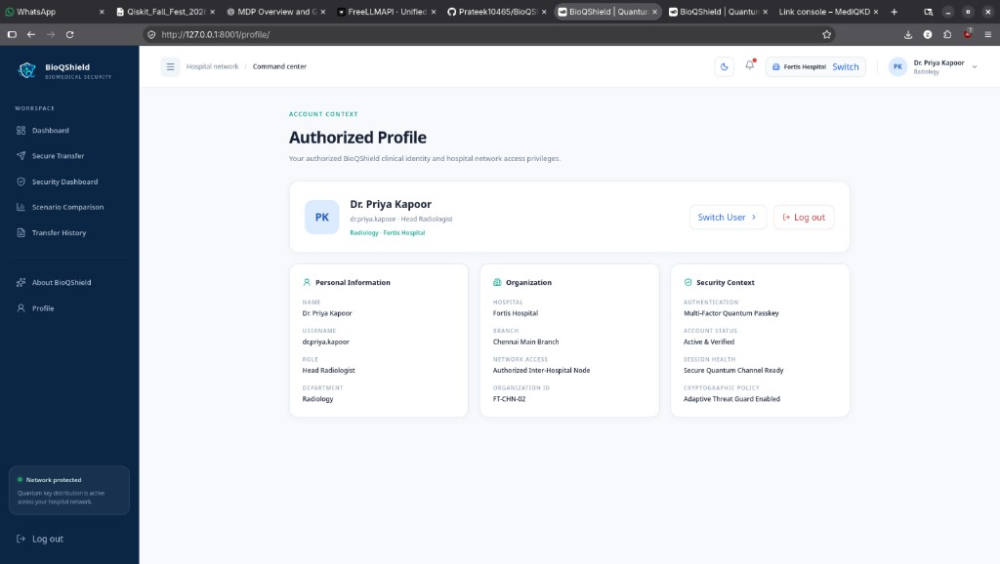

# BioQShield: Quantum-Secure Communication for Biomedical Networks

[](https://www.python.org/downloads/)
[](https://nextjs.org/)
[](https://qiskit.org/)
[](https://www.etsi.org/)
[]()

**BioQShield** is an advanced post-quantum communication framework designed to protect critical biomedical data—such as electronic health records (EHR), diagnostic imaging scans, and real-time biometric vitals—during transit across federated hospital networks. 

By fusing **classical network threat intelligence (NSL-KDD)** with **quantum key distribution (BB84 via Qiskit Aer)**, BioQShield dynamically adapts its security posture to protect healthcare infrastructure against classical cyberattacks and future quantum eavesdropping.

---

## 📸 System Overview


*Figure 1: Technical Security Operations Center (SOC) dashboard displaying real-time NSL-KDD threat scoring, measured QBER across qubit streams, key availability, and dynamic security policy outcomes.*

<br/>

### Multi-Node Clinical & Security Interface

| Hospital Selection & Login | Scenario Comparison Matrix |
|:---:|:---:|
|  |  |
| *Multi-tenant hospital routing (Apollo vs Fortis)* | *Benchmarking 7 clinical scenarios (Static vs Adaptive)* |

| Security Architecture & Pipeline | Authorized Clinical Identity |
|:---:|:---:|
|  |  |
| *5-stage defense: Analyze, Establish, Verify, Policy, Encrypt* | *Role-based access control with node passkey binding* |

---

## 🛡️ Core Innovations & Architecture

```
┌────────────────────────────────────────────────────────────────────────────────────────┐
│                              BIOQSHIELD ARCHITECTURE                                    │
└────────────────────────────────────────────────────────────────────────────────────────┘

     HOSPITAL A (Apollo - :8001)                          HOSPITAL B (Fortis - :8002)
   ┌─────────────────────────────┐                     ┌─────────────────────────────┐
   │  Next.js 16 Clinical Portal │                     │  Authenticated Destination  │
   │  NSL-KDD Threat Classifier  │                     │  AES-256-GCM Decryption     │
   │  Alice BB84 Qubit Transmitter│                     │  Bob Measurement Bases      │
   │  Workforce & Admin Control  │                     │  Peer Key Store / Inbox     │
   └──────────────┬──────────────┘                     └──────────────▲──────────────┘
                  │                                                   │
                  │              OPTICAL QUANTUM LINK (:8003)         │
                  ├───────────────────────────────────────────────────┤
                  │  Simulated Quantum Fibre Channel                  │
                  │  • Photon Noise Injection                         │
                  │  • Eve Intercept-Resend Eavesdropping Probing     │
                  │  • Real-time Physical Wire Tamper Detection       │
                  └─────────────────────────┬─────────────────────────┘
                                            │
                                            ▼
                             ETSI GS QKD 014 KME STUB (:8004)
                             • REST Key Management Entity
                             • Single-use Key Pools & TTL Expiry
                             • Emergency Memory Zeroisation
```

1. **Adaptive Threat-Aware Quantum Policy**:
   - Rather than relying on a static QBER cutoff, BioQShield continuously feeds NSL-KDD threat telemetry into its decision engine:
     $$\text{Accept Threshold} = 0.06 - 0.03 \times \text{Threat Score}$$
     $$\text{Reject Threshold} = 0.11 - 0.04 \times \text{Threat Score}$$
   - When elevated network risk is detected ($\text{Threat} \ge 0.8$), the policy instantly escalates, tightening QBER tolerances and halting key exchange.
2. **Zero-Leakage Cryptographic Enforcement**:
   - If a channel anomaly or eavesdropper is detected ($\text{QBER} \ge 11\%$), quantum key derivation is aborted. **Zero patient bytes are encrypted or transmitted**, guaranteeing zero information leakage.
3. **ETSI GS QKD 014 Key Management**:
   - Keys are managed in accordance with the ETSI GS QKD 014 standard. Key material is strictly single-use, subject to TTL expiration, and instantly zeroised upon consumption or alert.
4. **Role-Based Access Control (RBAC) & Dedicated Network Admin**:
   - **System Administrator (`admin`)**: Exclusively access the Network Admin Console (`/admin/`) to add/remove doctors & healthcare workers, trigger emergency key zeroisation, and configure nodes.
   - **Clinician (`dr.rao`)**: Execute secure transfers, review personal transfer histories, and inspect clinical telemetry. *Network Admin tab is strictly hidden and route-blocked.*
   - **Auditor (`auditor`)**: Verify HMAC hash chain audit integrity and monitor key pools without access to patient health data.
5. **HMAC-SHA256 Tamper-Evident Audit Trail**:
   - Every system event is chained cryptographically into an HMAC hash log with signed heads, verifiable on-demand via `/api/audit/verify` to detect reordering, deletion, or tampering.
6. **Enterprise Timestamp Pipeline**:
   - Real-time timestamping with dynamic localized formatting (`Today · hh:mm A`, `Yesterday · hh:mm A`, `DD MMM YYYY · hh:mm A`), persistent ISO tracking, and auto-healing of legacy placeholders.

---

## 🚀 Quick Start for Hackathon Judges & Evaluators

The application runs entirely with Python 3.11+. Node.js is **not required** to run the stack because the pre-compiled, optimized Next.js 16 build is already integrated into `frontend/`.

### 1. Installation

```bash
# Clone the repository
git clone https://github.com/Prateek10465/BioQShield.git
cd BioQShield

# Create and activate a virtual environment
python -m venv .venv
# Windows PowerShell:
.\.venv\Scripts\Activate.ps1
# Linux / macOS:
source .venv/bin/activate

# Install dependencies
python -m pip install -r requirements-node.txt
```

### 2. Launch the Multi-Node Stack

Start Hospital A, Hospital B, the Quantum Optical Channel, and the ETSI 014 KME stub simultaneously:

```bash
python scripts/run_all.py --fresh --etsi
```

Once started, the following services are live:

| Node / Service | Port / URL | Function |
|---|---|---|
| 🏥 **Hospital Command Centre (Alice)** | [http://127.0.0.1:8001](http://127.0.0.1:8001) | Main hospital portal: transfer wizard, security telemetry, dashboards, admin |
| 🏥 **Hospital B (Bob)** | [http://127.0.0.1:8002](http://127.0.0.1:8002) | Destination hospital receiving and decrypting patient payloads |
| 🛰️ **Optical Link Console (Eve)** | [http://127.0.0.1:8003](http://127.0.0.1:8003) | Eve intercept-resend switch, photon noise, and public channel relay |
| 🔑 **ETSI 014 Stub KME** | [http://127.0.0.1:8004](http://127.0.0.1:8004) | Central QKD key management entity server |

---

## 🌐 Instant Public Demo via Cloudflare Tunnel

To share a live, secure HTTPS link with hackathon judges from your machine:

```powershell
cloudflared tunnel --url http://127.0.0.1:8001
```

Share the generated `https://<random-id>.trycloudflare.com` URL with judges.

### Demo Credentials

| Role | Username | Password | Capabilities |
|---|---|---|---|
| **Doctor / Clinician** | `dr.rao` | `clinician-demo-pass` | Initiate secure transfers, inspect decrypted records *(Admin tab hidden)* |
| **System Admin** | `admin` | `admin-demo-pass` | Full **Network Admin** access, add/remove doctors & staff, emergency key zeroisation |
| **Auditor** | `auditor` | `auditor-demo-pass` | Verify tamper-evident HMAC audit log integrity |

---

## 🏆 Recommended 3-Minute Live Judge Demo

Set up two browser windows side by side:
- **Left Window:** Hospital Command Centre (`http://localhost:8001`)
- **Right Window:** Eve Link Console (`http://localhost:8003`)

1. **Clean Quantum Transfer**:
   - Log in as `dr.rao`. Navigate to **Secure Transfer**.
   - Select patient record and Fortis Hospital. Execute transfer.
   - Watch the live pipeline: QBER measures ~2.0%, decision evaluates to **ACCEPT**, a 256-bit AES key is derived, and destination decryption is verified.
2. **Active Eavesdropping Defense**:
   - In the Link Console window, toggle **Eve listening** to `ON` (intercepting photon stream).
   - In the Hospital window, execute another transfer.
   - Watch the quantum state collapse: QBER spikes to ~25%, exceeding the 11% threshold.
   - Adaptive policy evaluates to **REJECT**: Zero key release, AES encryption aborted, and **Zero-Leakage Enforcement** safely halts data transmission.
3. **Administrative Governance**:
   - Log in as `admin`. Open the exclusive **Network Admin** console.
   - Demonstrate workforce administration (adding/removing doctors and workers).
   - Click **Emergency Key Rotation**: watch active quantum key pools zeroise across both hospital nodes simultaneously.
   - Click **Verify Audit Integrity**: execute live HMAC-SHA256 mathematical hash verification.

---

## 🛠️ Testing & Verification

BioQShield includes an exhaustive test suite covering quantum algorithms, backend endpoints, and multi-node security protocols:

```bash
# Run the complete test suite
pytest

# Run hospital node and access control tests
pytest tests/test_hospital_apps.py -v
```

---

## 📁 Repository Structure

```
BioQShield/
├── bioqshield_contract.json      # Official Hackathon Architecture Contract v2.0
├── contract.json                 # Specification contract alias
├── Dockerfile                    # Container definition for multi-node services
├── docker-compose.yml            # Multi-service stack (Alice, Bob, Link)
├── docker-compose.etsi.yml       # ETSI 014 KME integration overlay
├── FrontendV2/                   # Next.js 16 TypeScript source (App Router)
│   ├── app/                      # Routes: dashboard, secure-transfer, admin, etc.
│   ├── components/               # React UI components & quantum visualizers
│   └── lib/api.ts                # Client API & dynamic timestamp formatting
├── frontend/                     # Pre-compiled static export served by FastAPI
├── nodes/
│   ├── alice.py                  # Hospital A application factory
│   ├── bob.py                    # Hospital B application factory
│   ├── hospital.py               # Shared hospital routing & security endpoints
│   ├── channel.py                # Quantum optical channel simulator & Eve probe
│   ├── etsi_stub.py              # ETSI GS QKD 014 Key Management Entity
│   ├── accounts.py               # Scrypt auth & brute-force throttling
│   ├── audit.py                  # HMAC-SHA256 tamper-evident hash log
│   └── vault.py                  # Local AES-256-GCM database encryption
├── quantum/
│   ├── bb84.py                   # BB84 protocol & sifting implementation
│   ├── bb84_qiskit.py            # Qiskit Aer circuit simulator
│   └── postprocess.py            # Cascade error correction & privacy amplification
├── threat/
│   └── classifier.py             # NSL-KDD machine learning threat model
├── scripts/
│   ├── run_all.py                # Multi-node local runner
│   └── build_frontend.py         # Frontend build and export pipeline
└── tests/                        # Comprehensive unit & end-to-end test suite
```

---

## 📄 License & Intellectual Property

Developed for the **Qiskit Fall Fest Hackathon 2026** under the Apache 2.0 / MIT License. All patient data, clinical entries, and telemetry streams are synthetic models intended strictly for cryptographic demonstration and educational research.
