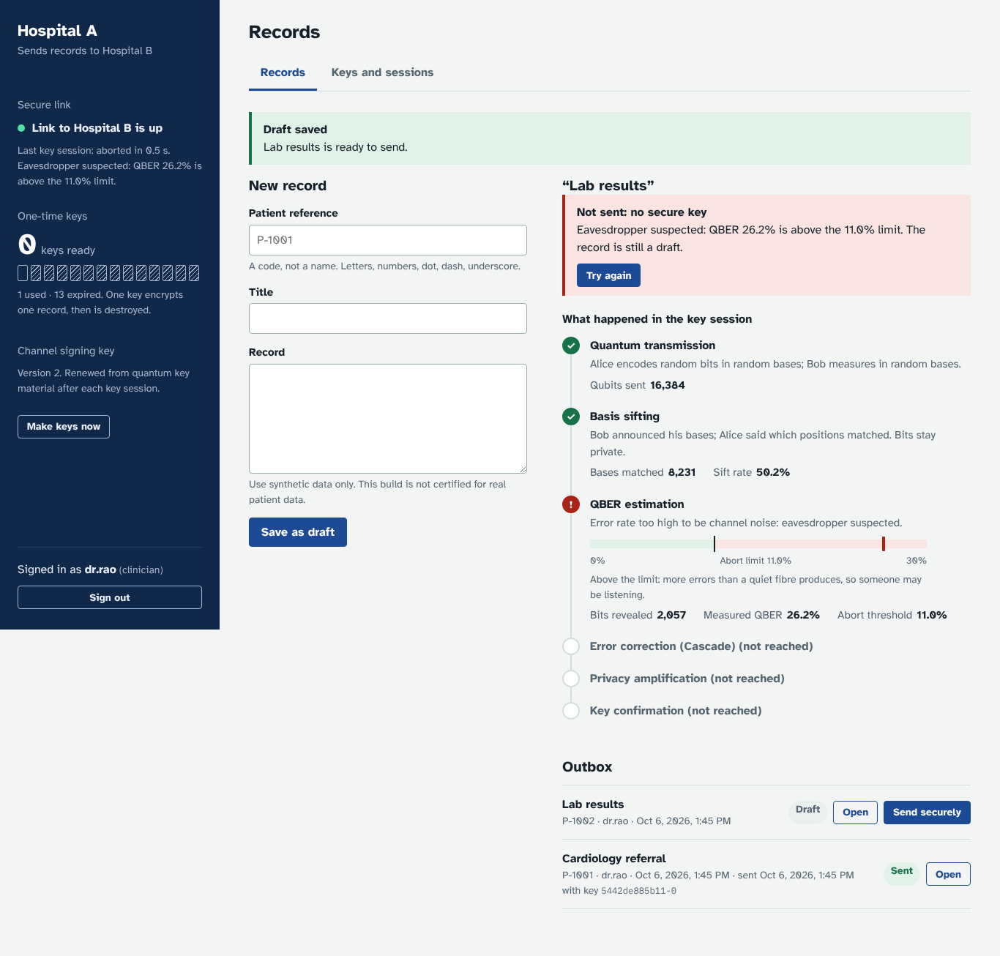

# MediQKD: patient records between two hospitals, keyed by quantum key distribution

Two hospital web apps, a link between them, and a key pool that is refilled by QKD. A clinician at
Hospital A saves a patient record and presses **Send securely**. The record is encrypted with a
one-time AES-256 key made by BB84 (or fetched from a QKD key manager) and decrypted at Hospital B.
If an eavesdropper is detected, **no key is made and nothing is sent**.



## Honest scope: read this first

- **The quantum part is simulated.** One process (the link service) plays the fibre, so it holds both
  sides' qubits. Real QKD needs photonic hardware. The protocol logic (BB84, sifting, QBER test,
  Cascade error correction, privacy amplification) is real and runs over real HTTP between separate
  services, but the physics is a model.
- **Hardware-ready, not hardware-tested.** Keys can instead come from any **ETSI GS QKD 014** key
  manager. That client is tested only against the stub in this repo, which makes random keys and is not
  quantum. It has never talked to a vendor KME.
- **Not a certified medical system.** No HIPAA/GDPR/ISO claim. Use synthetic data only.
- The link's authentication is HMAC-SHA256 with keys that QKD output keeps renewing. That is the
  standard practical setup, but it is computational, not information-theoretic.
- The secret-key-length calculation uses a simplified finite-key margin, not a composable security proof.
- Each service runs as one worker process (login throttling and replay tracking live in memory).

## Run it

Needs Python 3.11+.

```bash
pip install -r requirements-node.txt
python scripts/run_all.py --fresh          # link + Hospital A + Hospital B
```

| What | URL |
|---|---|
| Hospital A (sends) | http://localhost:8001 |
| Hospital B (receives) | http://localhost:8002 |
| Link console: switch Eve, noise and message tampering on and off | http://localhost:8003 |

The script prints demo logins for local use: `dr.rao` (clinician), `auditor`, `admin`.
Add `--etsi` to take keys from a stub ETSI key manager instead of simulated BB84.

### With Docker

```bash
python scripts/make_env.py --demo     # writes .env with fresh random secrets and prints the logins
docker compose up --build
docker compose -f docker-compose.yml -f docker-compose.etsi.yml up --build   # ETSI mode
```

Ports are bound to 127.0.0.1. The link console has no login on purpose (it is the attacker's
switchboard), so never publish it. The compose and Docker files are validated with `docker compose
config`, but the image was **not built in the environment this was written in** (no registry access).
Run the build once before relying on it.

## Try this (3 minutes)

1. Sign in to Hospital A as `dr.rao`, write a record, **Save as draft**, **Send securely**.
   The first send runs a key session; watch the six stages and the error-rate gauge.
2. Open Hospital B as `dr.rao`: the record appears within seconds, decrypted.
3. In the link console press **Eve listening**. Sign in to Hospital A as `admin`, **Rotate keys** so the
   pool is empty, then send another record as `dr.rao`: the error rate jumps to about 25%, the protocol
   refuses, the record stays a draft. Switch Eve off and **Try again**: it goes through.
4. Press **Altered messages** and send: Hospital B refuses the altered message and the key is destroyed.
5. Sign in as `auditor`, **Check the log has not been altered**.

## What is built

| Piece | Where | Notes |
|---|---|---|
| BB84, QBER test, Cascade, privacy amplification | `quantum/` | numpy; also a Qiskit circuit demo |
| Link service (fibre, Eve, noise, public channel relay) | `nodes/channel.py` | the only simulated component |
| Key source interface | `nodes/keysource.py` | `Bb84Sender/Receiver` or `Etsi014Sender/Receiver`; same app on top |
| ETSI GS QKD 014 client and stub KME | `nodes/keysource.py`, `nodes/etsi_stub.py` | `status`, `enc_keys`, `dec_keys`; mTLS via `QKD_KME_CERT/KEY/CA` |
| Session protocol over signed HTTP | `nodes/session.py`, `nodes/bobproto.py`, `nodes/common.py` | HMAC envelopes, sequence numbers, 5 min clock window |
| Key pool, one-time use, TTL, rotation | `nodes/keymanager.py`, `nodes/store.py` | used keys are zeroised; rotation also wipes Hospital B's copies |
| Encrypted storage | `nodes/vault.py`, `nodes/store.py` | AES-GCM per row, bound to row identity |
| Logins and roles | `nodes/accounts.py` | scrypt, hashed session tokens, throttling, clinician / auditor / admin |
| Tamper-evident audit log | `nodes/audit.py` | HMAC hash chain plus signed head; detects edits, deletes, truncation |
| Web apps | `frontend/portal/` | one script for both hospitals, and the link console |
| Threat classifier (NSL-KDD) + Accept / Monitor / Reject policy + Qiskit BB84 | `threat/`, `fusion/`, `quantum/bb84_qiskit.py`, `scripts/threat_qkd_demo.py` | see [docs/THREAT_QKD.md](docs/THREAT_QKD.md); NSL-KDD is not bundled, and the example figures use synthetic stand-in data |
| Lab dashboard (original single-process demo) | `backend/`, `frontend/`, `cli.py` | `uvicorn backend.main:app --port 8000` |

### Roles

| Role | Can | Cannot |
|---|---|---|
| clinician | create, send and read records; read the inbox; make keys | read the audit log, manage users or rotate |
| auditor | read and verify the audit log; see key and session activity | see any patient record |
| admin | manage users, rotate keys, read the audit log | see any patient record |

### How a record is protected

- Each record gets its **own key**; the key is destroyed after use on both sides. Unused keys expire
  after `QKD_KEY_TTL` (default 1 hour). Keys within 60 s of expiry are not handed out.
- A failed or blocked send destroys the key at Hospital A **and asks Hospital B to destroy its copy**, so
  a message an attacker held back cannot be delivered later.
- **Rotation** (admin) wipes every unused key on both hospitals, for use after a suspected attack.
- Databases hold records and keys sealed with `QKD_MASTER_KEY`. The service refuses to start if the key does
  not match the database. Audit entries contain ids and events, never patient text.
- Secrets come from environment variables. Nothing has a built-in password; with none configured the admin
  password is generated and printed once.

## Tests

```bash
pip install -r requirements.txt
python -m pytest -q                   # 91 tests, about a minute
python -m pytest -q -m "not e2e"      # fast ones only
```

`tests/test_e2e.py` starts the real processes and checks: send and receive, one key per record, Eve
blocking (full and partial), tampering refused, rotation, key expiry on both sides, restart survival,
audit integrity, ciphertext-only on the wire, and the ETSI path including a key-manager outage.

## Configuration

| Variable | Meaning |
|---|---|
| `QKD_AUTH_KEY` | pre-shared secret for the first session, same on both hospitals |
| `QKD_MASTER_KEY` | 64 hex chars; encrypts that hospital's database. Per hospital. Generated into the data directory if unset (local use only) |
| `QKD_ADMIN_PASSWORD`, `QKD_DEMO_USERS`, `QKD_CLINICIAN_PASSWORD`, `QKD_AUDITOR_PASSWORD` | first accounts |
| `QKD_KEY_SOURCE` | `bb84` (default) or `etsi014` |
| `QKD_KME_URL`, `QKD_KME_API_KEY`, `QKD_SELF_SAE`, `QKD_PEER_SAE` | ETSI mode |
| `QKD_KEY_TTL`, `QKD_QUBITS`, `QKD_DATA_DIR` | key lifetime (s), qubits per session, storage |

## Known limits

- A message that an attacker blocks and replays in ETSI mode is not revoked at the receiver (the revoke message is BB84-only).
- The link console and stub KME are test tools with no authentication.
- No HTTPS in the app itself: put a TLS proxy in front for anything beyond localhost.
- Qubit counts per session are small (16 384), so a session yields about 13 AES keys at 2% noise, about 6 at 5%, and none from about 7% (measured). The 11% abort threshold is the hard ceiling; the key-rate floor bites first.

The original lab dashboard notes are kept in `docs/LAB.md`.
